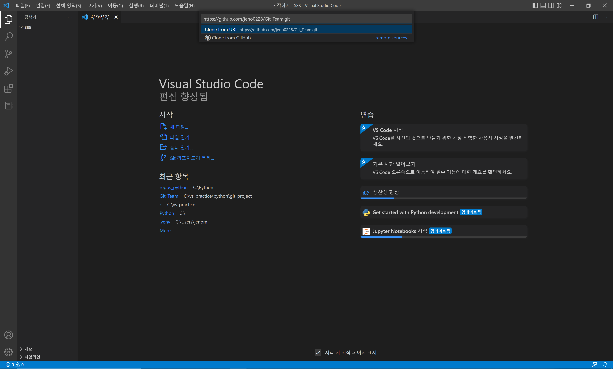

# visual studio code에서 github 연동

## 처음

> github에서 clone 하기
  1. F1 누르기
  2. Git Clone 선택
  3. 깃허브 주소 복사 

 * <https://github.com/jeno0228/Git_Team.git>
 
 

 
  4. 작업할 폴더 선택

  5. 위에 ... -> branch -> create branch 눌러서 새로운 브랜치 만들기
  
  

  6. 작업하기

  7. 커밋 메세지 작성 후 커밋 (이상한 창 뜨면 yes 누르기)

  8. publish branch 클릭

  

  9. ... -> push 누르기

  10. github 들어가서 해당 브랜치로 들어가서 pull request 요청

  11. 관리자(팀장) 한테 연락해서 확인하고 merge해달라고 하기

  12. merge 되면 브랜치 삭제

